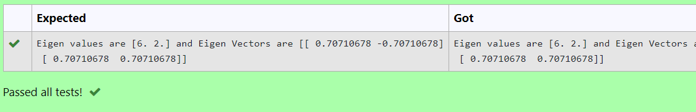

# INVERSE-OF-A-MATRIX
## Aim:
To write a python program to find the inverse of a matrix
## Equipment’s required:
1. 	Hardware – PCs
2. 	Anaconda – Python 3.7 Installation / Moodle-Code Runner
## Algorithm:
### Step1 : 
Import numpy library
### Step 2: 
Assign the values to the arrays created
### Step 3: 
Use the np.linalg.inv() find the inverse of the matrices
### Step 4: 
End the program

## Program:
```
Inverse of a matrix
Name: Soundariyan M N
Register no: 22008347
```
```python
import numpy as np
a= np.array([[1,0,3],[-1,2,-2],[2,3,-1]])
b= np.linalg.inv(a)
print(b)
```
## Output:

## Result:
Thus the inverse of given matrix is successfully solved using python program

